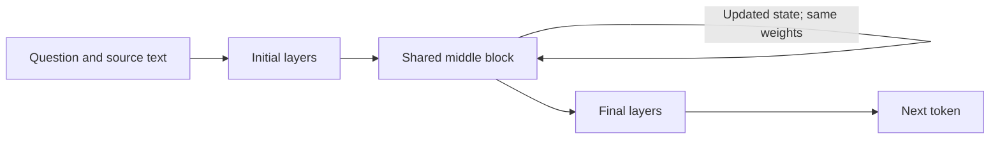

# Recurrent depth, J-space, and the Bible assistant

Research checked September 9, 2026. The owner's research topic has been received. This is a research assessment and proposed experiment sequence, not an approved training run. Retained original-text Inkling B, the private chat, and frozen results are unchanged. No candidate inference, weight download, or training was performed for this assessment.

## Recommendation

Explore recurrence as a separate model experiment before deciding whether to train again. First establish whether an existing small recurrent model can answer useful English questions about supplied biblical text and whether additional internal passes help that same model. Do not attempt to convert the full Inkling base as the first experiment. Its existing B adapter is not portable to a different model family.

The product objective remains an English conversational assistant genuinely adapted to original-language biblical material, with historical interpretation and appropriate Bible-based reflections. Recurrence might improve how a model processes evidence; it does not supply missing manuscripts or establish the meaning of an ambiguous passage. Any benefit for this domain is currently a hypothesis.

## What the idea means

A recurrent-depth transformer reuses a block of layers several times, carrying an updated internal state between passes. The weights stay the same during those passes. An illustrative design is:

For example, a four-layer block executed eight times performs 32 core-layer applications without storing 32 different layers. This increases effective depth and computation, not the width of each hidden vector. Loop boundaries, input reinjection, caching, and stopping rules depend on the architecture. Recurrent depth has established antecedents in [Universal Transformers](https://arxiv.org/abs/1807.03819); later [looped-transformer work](https://arxiv.org/abs/2502.17416) studies its reasoning advantages and limits.

Repeatedly asking an API to revise its previous text is a different experiment. So is increasing a model's ordinary reasoning-token allowance. Neither demonstrates that its internal transformer layers have been looped. More passes also need not keep improving an answer: [STARS](https://arxiv.org/abs/2605.26733) studies degradation beyond trained depths and a stabilization approach on limited tasks and Ouro fine-tuning.

## The Anthropic connection and the Astra claim

The remembered Anthropic work is [Verbalizable Representations Form a Global Workspace in Language Models](https://transformer-circuits.pub/2026/workspace/index.html). Its J-lens reveals vocabulary-associated internal representations that emerge during training. J-space is an interpretability description of activity, not an extra module we can attach or a setting for model depth. The authors also test causal interventions. Their [explanation](https://www.anthropic.com/research/global-workspace) distinguishes the studied forward-pass workspace from recurrent processing. More loops expanding or improving this workspace remains an experimental question.

There is now a direct research connection: [J-CoT](https://arxiv.org/abs/2607.21981), submitted July 24, 2026, passes vocabulary-indexed intermediate states between reasoning cycles. It is explicitly work in progress. That is relevant evidence to investigate, not validation of arbitrary layer repetition or biblical-language competence.

The owner's suggestion that GPT-6 Astra uses recurrent depth remains unverified in this review. The official [Astra model page](https://developers.openai.com/api/docs/models/gpt-6-astra) and [model guidance](https://developers.openai.com/api/docs/guides/latest-model) describe capabilities and reasoning controls but do not establish a looped-transformer architecture. This is a limit of the checked documentation, not evidence that Astra cannot use recurrence. Model identity, answer quality, and output-token efficiency cannot resolve the architecture question.

## Research that changes our options

These are author reports and releases, with different levels of maturity. None of the inspected evaluations establishes English access to biblical Hebrew, Aramaic, or Greek, or preservation of our B adaptation.

| Approach | Relevant evidence | Project implication |
|---|---|---|
| Huginn | [Paper](https://arxiv.org/abs/2502.05171) and [released model](https://huggingface.co/tomg-group-umd/huginn-0125): 3.5B recurrent model, with initial/shared/final stages and inference-depth control; 800B training tokens. | A concrete architecture probe from a University of Maryland research group. The release is a pretraining proof of concept, without subsequent post-training; conversational competence needs testing. |
| Ouro / LoopLM | [Paper](https://arxiv.org/abs/2510.25741): released 1.4B and 2.6B models using shared recurrent computation, with 7.7T reported pretraining tokens. | Compact stored weights make experimentation plausible. Parameter-count comparisons with larger models are not equal-compute comparisons. |
| Retrofitted Recurrence | [Paper](https://arxiv.org/abs/2511.07384) and [code](https://github.com/mcleish7/retrofitting-recurrence): converts pretrained models near 1B scale, with a recurrence curriculum and math improvements at matched training compute. The main math continuation uses about 50B tokens. | Evidence that conversion is possible; its demonstrated recipe is substantially larger than our Bible adaptation. It does not establish a cheap Inkling conversion. |
| J-CoT | [Work-in-progress paper](https://arxiv.org/abs/2607.21981): its main frozen-backbone experiment uses Qwen3-8B and selected-layer cycles through a J-space boundary. No author implementation was linked in the inspected paper. | Closest conceptual match to the owner's combined idea; replication and language retention are unresolved. |
| Latent Recurrent Thoughts | [September 1 preprint](https://arxiv.org/abs/2609.01117) and [author code](https://github.com/czl-david/latent-recurrent-thoughts): small trained proposer/refiner modules supply latents to a frozen decoder; modules are trained per task family. | A potentially cheaper trainable component, but it is auxiliary recurrence, not repeated middle layers. Task-specific benchmark success does not establish a general Bible assistant. |

Training a new recurrent base from scratch is outside this project's initial budget. Continuing from a released model or replicating a small auxiliary-module method is a different cost proposition, to be measured rather than ruled out categorically.

## What Tinker can and cannot currently do

The inspected public API and installed SDK 0.27.1 expose managed LoRA on supported base models. Model creation selects a base, rank, seed and broad trainable module classes. They expose no custom forward graph, layer-loop interval, hidden-state recurrence, or loop-count control. This is a statement about available controls, not undisclosed provider internals. [ServiceClient](https://tinker-docs.thinkingmachines.ai/tinker/api-reference/serviceclient/), [LoRA configuration](https://tinker-docs.thinkingmachines.ai/tinker/api-reference/types/loraconfig/).

Tinker's [custom loss](https://tinker-docs.thinkingmachines.ai/tinker/losses/custom/) operates on returned token log probabilities; it does not replace the forward architecture. Inkling's [thinking-effort conditioning](https://tinker-docs.thinkingmachines.ai/cookbook/inkling/thinking-effort/) is not a documented recurrent-depth setting. Neither Huginn nor Ouro appeared in the checked [model catalog](https://tinker-docs.thinkingmachines.ai/tinker/models.json).

An exported B adapter still depends on its Inkling base. Reusing it in altered model code would be a new compatibility experiment; it would not preserve the validity of B's earlier measurements. Supporting recurrence elsewhere requires a runtime and, for training, gradients that actually implement the chosen architecture.

## Proposed sequence and evaluation

The existing [evaluation runbook](EVALUATION-RUNBOOK.md) governs freezing, source eligibility, blinded review, completeness, failure accounting, and separation of development questions from fresh evaluation. Create a separately named recurrence protocol and run directory; do not alter an earlier frozen protocol or reuse its questions as independent evidence.

1. **Pin a runnable candidate.** Inspect the exact model revision, custom code, tokenizer, license files and dependencies. Provisionally start with [Ouro-1.4B-Thinking](https://huggingface.co/ByteDance/Ouro-1.4B-Thinking), whose author card documents configurable recurrent steps and four default passes. Use its reference implementation to make actual execution count inspectable. The card labels it a research release and has version-sensitive cache guidance. Huginn is the alternative if its language behavior or reference implementation is more suitable. This shortlist does not select a production successor.
2. **Establish a small runtime check.** First use clearly labeled development fixtures: faithful Unicode handling, short English instruction following and a supplied original-language passage. Confirm actual loop execution, cache correctness, peak memory, completion and latency. An 8 GB laptop is not an assumed training host; local inference suitability remains unmeasured. Use a quoted temporary GPU session if necessary, with an idle shutdown and hard time cap.
3. **Freeze a recurrence-specific comparison.** Proposed inventory: 24 new questions covering Hebrew, Greek, Aramaic, textual uncertainty/history, broad biblical reflection and general retention. Freeze exact items, source closure, reviewer criteria, prompts, model revisions, loop counts and failure rules before generating scored outputs. Use at least two supported depths of the same checkpoint. Supply identical evidence and decoding settings within that comparison. If B is sampled as a product reference, preserve its native format and count it separately; differences between bases cannot isolate recurrence.
4. **Evaluate quality against computation.** Score every material factual claim, requested coverage, translation alternatives, source attribution and uncertainty. For life application, assess Bible grounding and the distinction between ancient context and present reflection. Reviewers should receive final answers with model/depth labels hidden. Report completed, partial, failed and unsubmitted slots. Record wall-clock latency, peak memory, input/output tokens and billed compute; equal token limits do not imply equal latent computation. Include a fixed-time or fixed-compute comparison where the runtime allows it. Predefine a second-seed replication if initial results justify it.
5. **Decide whether a small adaptation is warranted.** Advance only if English/ancient-language competence is usable and depth has a credible quality-versus-cost benefit. Then propose original-text adaptation on that recurrent base, with separate before/after adaptation and low/high-depth controls. Verify shared weights, gradient handling, optimizer updates and checkpoint reload in a tiny smoke run before a larger commitment. Training still requires the owner's plan review and explicit go-ahead.

The 24-question inventory is a design proposal, not a frozen benchmark or a promise of statistical certainty. Thresholds and exact sample allocation must be fixed with the protocol before outputs exist. Model developers must not see new evaluation contents until any proposed training dataset is frozen. AI review remains labeled AI review; specialist biblical-language review remains needed before strong accuracy claims.

For a first remote inference study, propose a **maximum $50 administrative cap**, subject to a current compatible-GPU quote including storage and transfer. This is neither a price estimate nor a launched reservation. Quote and review any training budget after the inference result; do not assume that few trainable parameters guarantee cheap training or hosting. No always-on recurrent service is proposed yet.

## Continuity and next handoff

The pending sixteen-slot old-versus-new attribution-guidance comparison on B remains a separate P4 proposal. Recurrence research neither completes it nor proves the guidance candidate improves answers. Preserve the [known-topic pilot](EVIDENCE-PILOT-V1.md), including its extra post-review error, and the [offline guidance candidate](EVIDENCE-ANSWER-CONTEXT.md).

The immediate next deliverable is a pinned candidate/runtime assessment and concrete prospective protocol. Sol workers can inspect reference code and prepare bounded checks; the primary agent owns design review and the training recommendation. Record results, failed options and promotion criteria in the public decision history without publishing private prompts, answers, credentials or account details. The owner topic is received; training-plan review is still pending.
